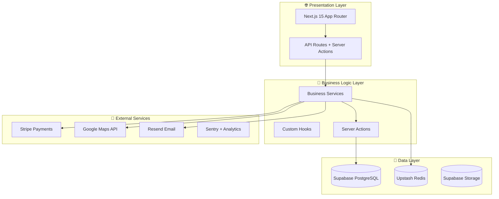

# 🏗️ ARCHITECTURE - Vantage Lane 2.0

**Documentația completă a arhitecturii și scopului proiectului**

## 🎯 **PROJECT VISION & SCOPE**

### **What is Vantage Lane 2.0?**

Premium luxury chauffeur booking platform care conectează clienții premium cu șoferi profesionali pentru transport executiv, evenimente și experiențe personalizate de călătorie.

### **Core Business Model:**

- **B2B2C Marketplace:** Clienți corporativi + utilizatori premium individuali
- **Commission-based:** 15-25% din fiecare booking
- **Tier System:** Bronze → Silver → Gold → Platinum → Elite
- **Geographic Focus:** London + expansiune UK

## 🏛️ **HIGH-LEVEL ARCHITECTURE**

### **System Architecture Pattern: Clean Architecture + Domain-Driven Design**



## 🗂️ **DETAILED FOLDER ARCHITECTURE**

### **🎯 Design Principles:**

1. **Separation of Concerns:** Clear boundaries între layers
2. **Single Responsibility:** Fiecare modul are o responsabilitate
3. **Dependency Inversion:** High-level modules nu depind de low-level
4. **Feature-based Organization:** Group by business domain
5. **Scalability First:** Structure suportă growth fără reorganization

### **📁 Core Architecture Layers:**

#### **Layer 1: Presentation (`/src/app/`)**

```
Purpose: User interface și routing
Responsibility: UI rendering, user interactions, routing
Dependencies: Business Logic Layer
Technologies: Next.js 15, React 19, Tailwind CSS
```

#### **Layer 2: Business Logic (`/src/components/`, `/src/hooks/`, `/src/server/`)**

```
Purpose: Business rules și application logic
Responsibility: Feature implementations, state management
Dependencies: Data Layer, External Services
Technologies: React Server Components, Zustand, Custom Hooks
```

#### **Layer 3: Data Layer (`/src/lib/db/`, `/src/lib/cache/`)**

```
Purpose: Data persistence și retrieval
Responsibility: Database operations, caching, file storage
Dependencies: External databases și storage
Technologies: Supabase, Redis, PostgreSQL
```

#### **Layer 4: Infrastructure (`/src/lib/monitoring/`, `/src/lib/logger/`)**

```
Purpose: Cross-cutting concerns
Responsibility: Logging, monitoring, security, health checks
Dependencies: None (foundation layer)
Technologies: Pino, Sentry, Custom utilities
```

## 🧩 **COMPONENT ARCHITECTURE**

### **Component Hierarchy & Responsibilities:**

#### **🎨 UI Components (`/src/components/ui/`)**

- **Purpose:** Reusable, unstyled base components
- **Examples:** Button, Card, Input, Dialog
- **Dependencies:** Design system tokens only
- **Pattern:** Compound components cu Radix UI

#### **🏗️ Layout Components (`/src/components/layout/`)**

- **Purpose:** Page structure și navigation
- **Examples:** Header, Footer, Sidebar, Navigation
- **Dependencies:** UI components, theme system
- **Pattern:** Render props și composition

#### **🎭 Feature Components (`/src/components/features/`)**

- **Purpose:** Business logic specific components
- **Examples:** BookingForm, PaymentFlow, UserDashboard
- **Dependencies:** Business services, custom hooks
- **Pattern:** Container/Presenter pattern

#### **📝 Form Components (`/src/components/forms/`)**

- **Purpose:** Form handling și validation
- **Examples:** LoginForm, BookingForm, ProfileForm
- **Dependencies:** react-hook-form, zod validation
- **Pattern:** Controlled components cu validation

## 🔄 **DATA FLOW ARCHITECTURE**

### **Request/Response Flow:**

```
1. User Interaction (UI)
   ↓
2. Event Handler (Component)
   ↓
3. Custom Hook (State Management)
   ↓
4. Server Action/API Route (Business Logic)
   ↓
5. Service Layer (Data Operations)
   ↓
6. Database/External API (Persistence)
   ↓
7. Response Flow (Reverse)
```

### **State Management Strategy:**

#### **🌐 Global State (Zustand)**

- User authentication state
- Theme preferences
- Shopping cart/booking state
- Navigation state

#### **🏠 Local State (React useState/useReducer)**

- Form state
- Component-specific UI state
- Temporary interaction state

#### **🔄 Server State (React Query pattern)**

- API data caching
- Background refetching
- Optimistic updates

## 💾 **DATABASE ARCHITECTURE**

### **🗃️ Supabase PostgreSQL Schema:**

#### **Core Tables:**

```sql
-- User Management
profiles (users, authentication data)
user_preferences (settings, notifications)
addresses (user addresses)

-- Business Logic
bookings (ride bookings)
vehicles (fleet management)
chauffeurs (driver profiles)
payments (transaction records)

-- System
audit_logs (compliance și monitoring)
notifications (user communications)
```

#### **🔒 Security Model:**

- **Row Level Security (RLS)** pe toate tables
- **Service Role** pentru admin operations
- **User Role** pentru client operations
- **Anonymous Role** pentru public data

## 🔌 **EXTERNAL INTEGRATIONS**

### **🏦 Payment Processing (Stripe)**

```
Architecture: Server-side processing + client webhooks
Security: PCI DSS compliant via Stripe
Flow: Payment Intent → Confirmation → Webhook → Database
Error Handling: Retry logic + manual reconciliation
```

### **🗺️ Maps & Location (Google Maps)**

```
Architecture: Client-side SDK + server geocoding
Caching: Redis pentru frequent locations
Flow: Address Input → Geocoding → Route Planning → Price Calculation
Rate Limiting: Per-user limits + caching
```

### **📧 Email System (Resend + React Email)**

```
Architecture: Template-based + transactional
Templates: React components în /src/emails/
Flow: Event Trigger → Template Render → Email Send → Delivery Tracking
Reliability: Retry logic + delivery confirmation
```

## 🛡️ **SECURITY ARCHITECTURE**

### **🔐 Authentication & Authorization:**

```
Provider: Supabase Auth (JWT-based)
Flow: Login → JWT → Session → RLS Policies
Session Management: Secure cookies + refresh tokens
Authorization: Role-based + resource-based permissions
```

### **🚨 Security Layers:**

1. **Input Validation:** Zod schemas pe toate inputs
2. **Rate Limiting:** Per-user și per-IP limits
3. **SQL Injection:** Supabase prepared statements
4. **XSS Protection:** React built-in + CSP headers
5. **CSRF Protection:** SameSite cookies + CSRF tokens
6. **Data Encryption:** HTTPS + database encryption

## 📊 **MONITORING & OBSERVABILITY**

### **🔍 Monitoring Stack:**

```
Error Tracking: Sentry (client + server)
Logging: Pino structured JSON logs
Metrics: Vercel Analytics + custom metrics
Health Checks: /api/health endpoint
Audit Trail: Database audit logs
Performance: Core Web Vitals tracking
```

### **📈 Key Metrics:**

- **Performance:** Page load time, API response time
- **Business:** Booking conversion, revenue per user
- **Technical:** Error rate, uptime, cache hit ratio
- **User:** Session duration, feature adoption

## 🚀 **DEPLOYMENT ARCHITECTURE**

### **🏗️ Infrastructure:**

```
Platform: Vercel (Edge Functions + CDN)
Database: Supabase (Multi-region PostgreSQL)
Cache: Upstash Redis (Global)
Storage: Supabase Storage (Images, documents)
Monitoring: Sentry + Vercel Analytics
```

### **🌍 Environment Strategy:**

```
Development: Local + Supabase Dev
Staging: Vercel Preview + Supabase Staging
Production: Vercel Production + Supabase Production
Testing: Local + Test Database
```

## 🔧 **DEVELOPMENT ARCHITECTURE**

### **🛠️ Development Workflow:**

```
Code → Git → GitHub → Vercel Build → Deploy
Quality Gates: ESLint → TypeScript → Tests → Build
Automation: Husky hooks + GitHub Actions
Review: PR reviews + automated checks
```

### **📦 Package Management:**

```
Manager: pnpm (performance + security)
Strategy: Exact versions pentru stability
Updates: Monthly security + quarterly features
Audit: Regular dependency scanning
```

## 🎯 **PERFORMANCE ARCHITECTURE**

### **⚡ Performance Strategy:**

#### **Frontend Optimization:**

- **Code Splitting:** Dynamic imports pentru large components
- **Image Optimization:** Next.js Image cu WebP/AVIF
- **Font Loading:** Preload critical fonts
- **Bundle Analysis:** Regular bundle size monitoring

#### **Backend Optimization:**

- **Caching:** Redis pentru frequent queries
- **Database:** Proper indexing + query optimization
- **API:** Response compression + rate limiting
- **CDN:** Static asset delivery via Vercel Edge

#### **Runtime Optimization:**

- **React:** Server Components + Streaming
- **Database:** Connection pooling + read replicas
- **Cache:** Multi-layer caching strategy
- **Monitoring:** Real-time performance metrics

## 📏 **SCALABILITY ARCHITECTURE**

### **🔄 Horizontal Scaling Strategy:**

```
Frontend: Edge deployment + CDN
API: Serverless functions (auto-scaling)
Database: Read replicas + connection pooling
Cache: Redis cluster + sharding
Storage: CDN + multi-region replication
```

### **📈 Growth Accommodation:**

- **Database:** Partitioning strategy pentru large tables
- **API:** Rate limiting + pagination
- **Search:** Full-text search cu PostgreSQL
- **Files:** Progressive upload + compression
- **Analytics:** Data warehouse pentru historical data

---

## 🎯 **ARCHITECTURAL DECISIONS RECORD (ADR)**

### **ADR-001: Next.js 15 App Router**

- **Date:** 2024-10-17
- **Decision:** Use Next.js 15 cu App Router
- **Rationale:** Server Components, improved performance, modern React features
- **Consequences:** Better SEO, faster loads, learning curve for team

### **ADR-002: Supabase pentru Backend**

- **Date:** 2024-10-17
- **Decision:** Use Supabase pentru database + auth + storage
- **Rationale:** Rapid development, built-in security, real-time features
- **Consequences:** Vendor lock-in, but faster time-to-market

### **ADR-003: Monolithic Frontend Architecture**

- **Date:** 2024-10-17
- **Decision:** Single Next.js app vs microservices
- **Rationale:** Simpler deployment, better DX, adequate pentru current scale
- **Consequences:** Easier maintenance, potential future refactoring needed

---

**🏆 Această arhitectură garantează scalabilitatea, maintainability și performance pentru Vantage Lane 2.0! 🏆**
